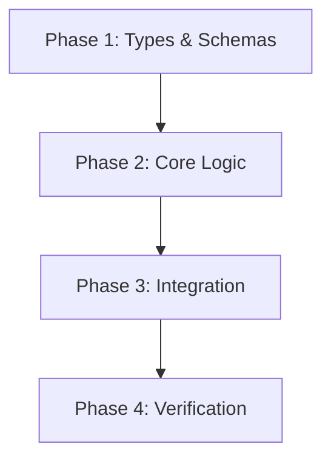

# /plan - Reality-Grounded Technical Implementation Planning Mode

$ARGUMENTS

---

## 🎯 Purpose & Core Principles

Activates **PLANNING MODE** to construct a rigorous, execution-ready implementation plan grounded 100% in actual codebase reality.

> **IRON INVARIANTS:**
> 1. **ZERO HALLUCINATED PATHS:** Every cited existing file, class, method, or schema MUST be verified in the actual repository before inclusion.
> 2. **CONCRETE FILE-LEVEL DIFFS:** Clearly classify every affected file as `[NEW]`, `[MODIFY]`, or `[DELETE]` with exact symbols and signatures.
> 3. **MULTI-PHASE DIRECTORY FIRST:** By default, generate a structured plan folder `plans/<YYYYMMDD>-<slug>/` with `plan.md` and individual `phase-NN-*.md` files.
> 4. **TEST-DRIVEN & VERIFIABLE:** Every phase must include automated test commands and observable acceptance criteria.

---

## ⚙️ Argument Parsing & Execution Flags

- `--single`: Force a single standalone plan file (`implementation_plan.md` or `plans/<slug>.md`) instead of a multi-phase folder.
- `--tdd`: Enforce strict Test-Driven Development (requires writing failing tests before implementation steps in each phase).
- `--fast`: Generates a condensed single-phase plan for small, low-risk, or localized changes.
- `$ARGUMENTS`: Task description, accepted brainstorm direction, feature request, or refactor target.

---

## 📁 Plan Directory Architecture

By default (for tasks with 2+ phases), create a dedicated directory:

```
plans/<YYYYMMDD>-<feature-slug>/
  ├── plan.md              # Master plan: Overview, Architecture, Dependency Graph, Phases Table
  ├── phase-01-<name>.md   # Phase 1: Foundation, Types & Schemas
  ├── phase-02-<name>.md   # Phase 2: Core Services & Business Logic
  ├── phase-03-<name>.md   # Phase 3: Endpoints & UI Integration
  └── phase-04-<name>.md   # Phase 4: E2E Verification & Migration
```

---

## 🔬 4-Phase Planning Protocol

```
┌────────────────────────┐     ┌────────────────────────┐
│ 1. CODEBASE SCOUT      │ ──► │ 2. PHASE SEQUENCING    │
│    (Ground-Truth Check)│     │    & Multi-File Splitting
└────────────────────────┘     └───────────┬────────────┘
                                           │
┌────────────────────────┐                 ▼
│ 4. VERIFICATION &      │ ◄── ┌────────────────────────┐
│    Rollback Matrix     │     │ 3. CONCRETE FILE DIFFS │
└────────────────────────┘     │    & Contract Specs    │
                               └────────────────────────┘
```

---

### Phase 1: Codebase Reality Scout (Ground-Truth Check)

Before writing any plan files, inspect the live repository:
1. **Locate Existing Entry Points & Models:**
   - Use `fast_context_search` and `grep_search` to discover existing patterns, models, middleware, and utilities.
   - Confirm exact file paths, exported symbol names, and directory conventions.
2. **Audit Consumers & Blast Radius:**
   - Search for all callers/usages of symbols that will be modified.
   - Identify existing test suites (`*.test.ts`, `*_test.go`, `test_*.py`) covering the affected areas.
3. **Verify Installed Dependencies:**
   - Check `package.json`, `go.mod`, `Cargo.toml`, or `requirements.txt`. Do NOT assume a package exists without checking.

---

### Phase 2: Multi-Phase Directory Generation & Sequencing

Decompose the work into sequential, independently testable phases:

- **Create Directory:** `plans/<YYYYMMDD>-<slug>/`
- **Draft Master `plan.md`:** Contains the global architecture, dependency graph, and phases summary table.
- **Draft Individual `phase-NN-*.md` Files:** Each file contains the detailed step-by-step implementation for that phase.

---

## 📋 Canonical File Templates

### 1. Master `plan.md` Template (`plans/<YYYYMMDD>-<slug>/plan.md`)

```markdown
# 📋 Master Plan: [Feature / Refactor Name]

**Target Objective:** [1-2 sentences summarizing the goal]
**Scope:** [Affected components, services, or layers]

---

## ⚠️ User Review Required

> [!IMPORTANT]
> List any breaking changes, public API modifications, database schema migrations, or key architectural decisions requiring explicit sign-off.

---

## 🗺️ Phases Summary & Dependency Graph



| Phase | File | Status | Description |
| :--- | :--- | :--- | :--- |
| **Phase 1** | [`phase-01-types.md`](file:///path/to/phase-01-types.md) | Pending | Contracts, DTOs, and Schema definitions |
| **Phase 2** | [`phase-02-services.md`](file:///path/to/phase-02-services.md) | Pending | Domain services & business logic |
| **Phase 3** | [`phase-03-integration.md`](file:///path/to/phase-03-integration.md) | Pending | API endpoints & UI wiring |
| **Phase 4** | [`phase-04-verification.md`](file:///path/to/phase-04-verification.md) | Pending | E2E testing, cleanup & rollback plan |
```

---

### 2. Phase Detail Template (`plans/<YYYYMMDD>-<slug>/phase-01-<name>.md`)

```markdown
---
phase: 1
title: "[Phase Title]"
status: pending
priority: P1
dependencies: []
---

# Phase [N]: [Phase Title]

## 1. Overview
[1-2 sentences describing what this phase delivers and why it comes at this step]

## 2. Affected Files & Actions
- **[NEW]** [`src/types/feature.ts`](file:///path/to/src/types/feature.ts)
  - Export `FeatureDTO`, `FeatureConfig`
- **[MODIFY]** [`src/models/schema.ts`](file:///path/to/src/models/schema.ts)
  - Add `status` enum field with default value

## 3. Step-by-Step Implementation
1. [Step 1: Define types and interfaces]
2. [Step 2: Add validation guards / assertions]
3. [Step 3: Export symbols in barrel index file]

## 4. Phase Verification & Test Command
- **Test Command:** `npm test -- tests/types/feature.test.ts`
- **Acceptance Criteria:**
  - [ ] Compiles with zero TypeScript / lint errors (`npm run type-check`)
  - [ ] Unit test passes 100%
```

---

## 🛑 Plan Boundaries & Anti-Patterns

- **DO NOT** write full implementation code inside plan files (keep snippets to signatures and contracts).
- **DO NOT** create a plan directory without individual `phase-*.md` files when work spans 2+ phases.
- **DO NOT** proceed to code implementation without user approval of the master plan.
